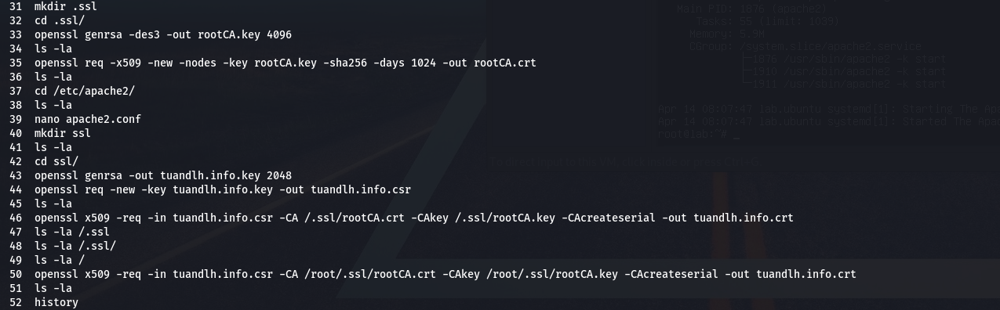
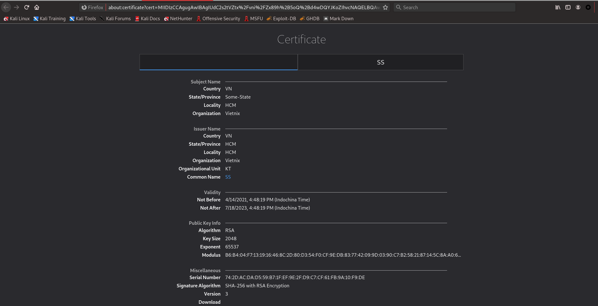
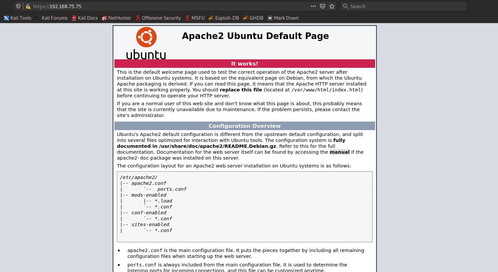

# Report_Vietnix_LinuxBasic

## BASE COMMAND:
#### `man <name_of_tool>` to see explain for tool and using Google Search to get more detail.

# *~~ MENU FOR PART 02 ~~*

# 1. SSL and references

*Define:* `Secure Sockets Layer (SSL)` is a networking protocol designed for securing connections between web clients and web servers over an insecure network, such as Internet. The evolution of SSL is `TLS (Transport Layer Security)`

*Using:* `SSL` using for almost network services such as: Webmail, FTPS, HTTPS, VPN Access Servers, Citrix Access Gateway, ...

*How it work:* 
* `SSL Certificate` from a website is issued by a trusted certificate authority as we call `Root CA`. The `Root CA` will be imported by default in Client Brower. When user connects to the website which has `SSL certificate` issued by `Root CA`, it will be trusted website!
* Once the website has been authenticated, the client and server establish cipher settings and a shared key to encrypt the information they exchange during the remainder of the session. 

## Step by with creating ROOT CA and Webserver CA.

1. Creating Root Key
1. Create self sign Root CA (imported to User Brower)
1. Creating server key
1. Creating server signing (csr)
1. Cefified server csr with RootCA.crt

Result 01: 

Result 02: 

Result 03:

## OR simplily buying SSL from other for sure!

# 2. 