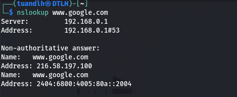
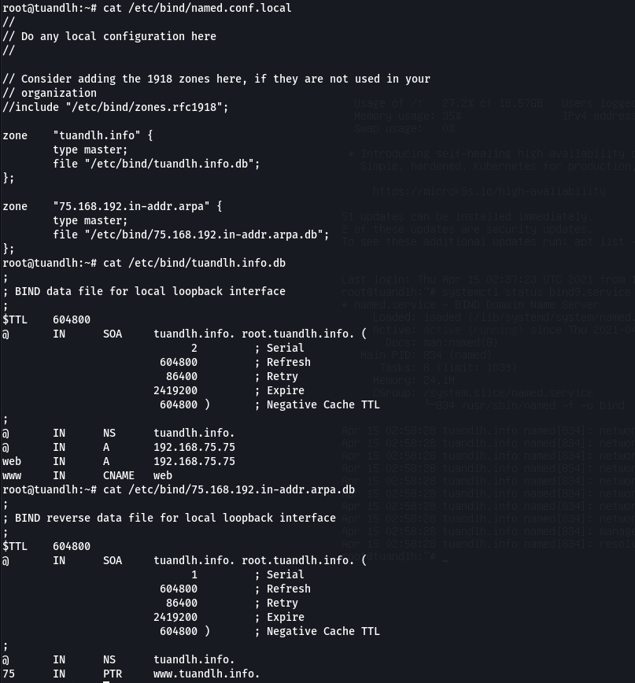
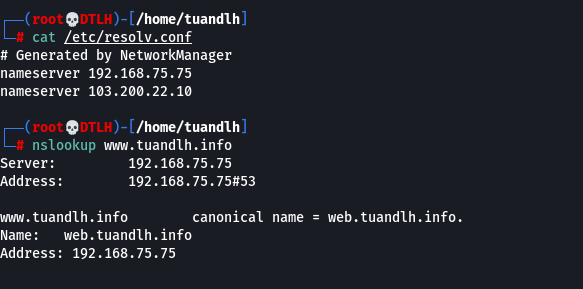
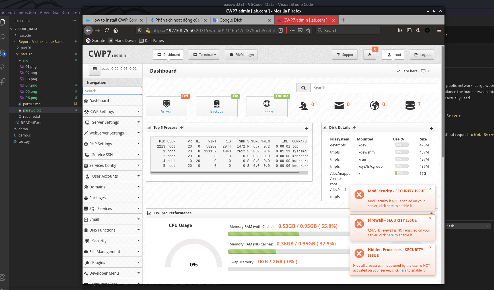
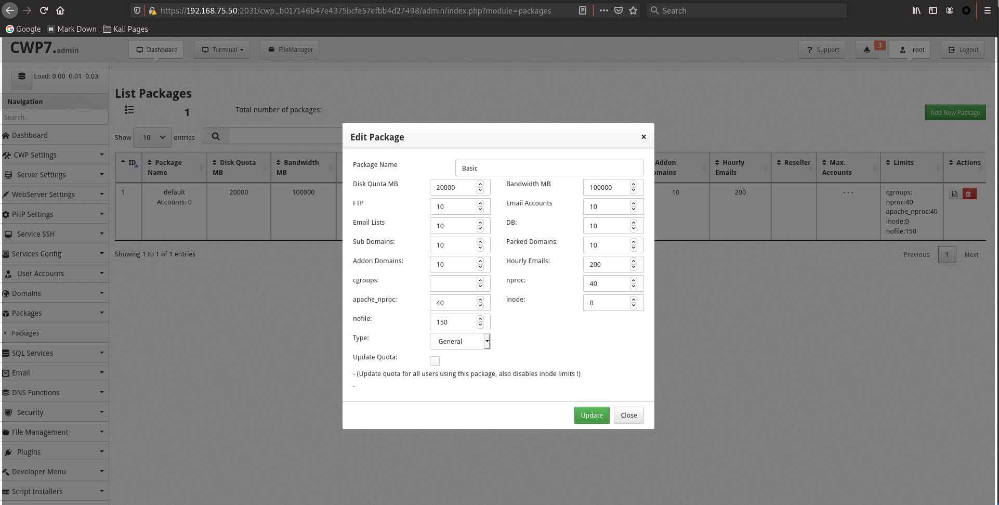
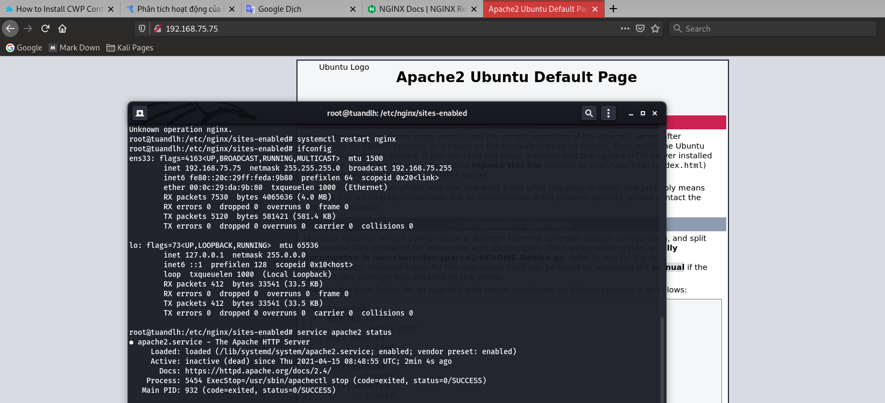

# Report_Vietnix_LinuxBasic

## BASE COMMAND:
#### `man <name_of_tool>` to see explain for tool and using Google Search to get more detail.

# *~~ MENU FOR PART 02 ~~*

1. <a href='#1'>SSL and references</a>
1. <a href='#2'>Domain</a>
1. <a href='#3'>What is DNS? Some record of DNS</a>
1. <a href='#4'>What is Hosting, VPS, Server</a>
1. <a href='#5'>Reverse Proxy</a>
1. <a href='#6'>Apache WebServer VS NGINX pros and cons</a>

<div id='1'></div>

# 1. SSL and references

*Define:* `Secure Sockets Layer (SSL)` is a networking protocol designed for securing connections between web clients and web servers over an insecure network, such as Internet. The evolution of SSL is `TLS (Transport Layer Security)`

*Using:* `SSL` using for almost network services such as: Webmail, FTPS, HTTPS, VPN Access Servers, Citrix Access Gateway, ...

*How it work:* 
* `SSL Certificate` from a website is issued by a trusted certificate authority as we call `Root CA`. The `Root CA` will be imported by default in Client Brower. When user connects to the website which has `SSL certificate` issued by `Root CA`, it will be trusted website!
* Once the website has been authenticated, the client and server establish cipher settings and a shared key to encrypt the information they exchange during the remainder of the session. 

## Step by with creating ROOT CA and Webserver CA.

1. Creating Root Key
1. Create self sign Root CA (imported to User Brower)
1. Creating server key
1. Creating server signing (csr)
1. Cefified server csr with RootCA.crt

Result 01: 


Result 02: 


Result 03:


## OR simplily buying SSL from other for sure!

<div id='2'></div>

# 2. Domain

*Define:* 
* A `domain name` is an identification string that defines a realm of administrative autonomy, authority or control within the `Internet`. Domain has tree structure started at `Top-level Domain (TLDs)` managed by `Internet Corporation for Assigned Names and Numbers (ICANN)` (such as: `.com`, `.net`, ...).
* Below the top-level domains in the domain name hierarchy are the `second-level domain (SLD)` names such as: `thegioididong.com`, `vnexpress.net`, ...
* Basically, One domain name will mark with one or more `Server IPs` stored in `Domain Name System (DNS)`. When user wants to connect to `Server`, he types `domain name` in his Brower. Based on the `DNS Server`, his brower will receive `Server IP` and brower using it to connect to server!

Result: 



<div id='3'></div>

# 3. What is DNS? Some record of DNS.

*Define:* The `Domain Name System (DNS)` is a hierarchical and decentralized naming system for computers, services, or other resources connected to the `Internet` or a `Private network`. 

*Type of DNS record:*
* Start of Authority (SOA)
* IP addresses (A and AAAA)
* SMTP mail exchangers (MX)
* Name servers (NS)
* Pointers for reverse DNS lookups (PTR)
* Domain name aliases (CNAME)

# Demo: Ubuntu with `bind9` DNS Server

```
sudo apt-get install bind9
sudo apt-get install dnsutils

# Change named.config.local
nano /etc/bind/named.config.local

zone    "tuandlh.info" {
        type master;
        file "/etc/bind/tuandlh.info.db";
};

zone    "75.168.192.in-addr.arpa" {
        type master;
        file "/etc/bind/75.168.192.in-addr.arpa.db";
};

# Create two files as in named.config.local

# Edit two files as below:

# For Forward tuandlh.info.db

$TTL	604800
@	IN	SOA	tuandlh.info. root.tuandlh.info. (
			      2		; Serial
			 604800		; Refresh
			  86400		; Retry
			2419200		; Expire
			 604800 )	; Negative Cache TTL
;
@	IN	NS	tuandlh.info.
@	IN	A	192.168.75.75
web	IN	A	192.168.75.75
www	IN	CNAME	web

# For Reverse 75.168.192.in-addr.arpa.db

$TTL	604800
@	IN	SOA	tuandlh.info. root.tuandlh.info. (
			      1		; Serial
			 604800		; Refresh
			  86400		; Retry
			2419200		; Expire
			 604800 )	; Negative Cache TTL
;
@	IN	NS	tuandlh.info.
75	IN	PTR	www.tuandlh.info.

# Change /etc/hostname as 'tuandlh.info'

# Restart system
```

Config :



Result: 




<div id='4'></div>

# 4. What is Hosting, VPS, Server

## 4.1 Web Hosting
*Define:* `Web hosting` happens when the files that make up a website are uploaded from a local computer on to a web server. The server’s resources, (RAM, hard drive space, and bandwidth) are allocated to the websites using it. 
There are six types of hosting:
* Shared hosting
* VPS (Virtual Private Server)
* Dedicated Server (more expensive for big business)
* Cloud hosting
* Managed hosting
* Colocation

## 4.2 Server
*Define:* A `server` is a piece of computer hardware or software (computer program) that provides functionality for other programs or devices, called "clients". This architecture is called the `client–server model`. 


## 4.3 Virtual Private Server (VPS)

*Define:* 
* `A virtual private server (VPS)` is a virtual machine sold as a service by an Internet hosting service. The `virtual dedicated server (VDS)` also has a similar meaning.
* `Virtual private server` runs its own copy of an operating system (OS), and customers may have `superuser-level` access to that operating system instance, so they can install almost any software that runs on that OS.

*How it works:* 
* There is one `Master Server` which installed `Softaculous Virtualizor` or `cpanel/WHM` or `cPanel/cwp` or something else.
* The `Master Server` will create many VPSs for clients based on their need!

## 4.4 Demo cPanel/ CWP on Cent OS

Code:
```
wget http://centos-webpanel.com/cwp-el7-latest
chmod u+x cwp-el7-latest
./cwp-el7-latest
# Using Brower to connect to CWP: https://your_server_ip:2031
```

Homepage of CWP



Package of CWP using for SALE!



<div id='5'></div>

# 5. Reverse Proxy

*Define:* 
* `Reverse proxy` is a common type of proxy server that is accessible from the public network. Large websites and content delivery networks use reverse proxies – together with other techniques – to balance the load between internal servers.
* `Reverse proxy` can hide the existence and characteristics of servers that are actually used.

*How it works:*
* The first time user sends resquest to `Reverse Proxy`, `RP` will send it to `Web Server`.
* `Web Server` response to `RP` and `RP` send it to Client
* `RP` also saved web content as `caches`
* When user sends request later, `RP` just sends content from `cache` to client without request to `Web Server`.

# *Demo:* We can use `Nginx Reverse Proxy` and `Apache2` as web server to demo.

Result: 



> Explain: In this `Web Server` I did not run `Apache2` at `192.168.75.75`, instead of, I run `Nginx Reverse Proxy` and config it to redirect to other `Apache2` web server at `192.168.75.50`. I use client brower to connect to `192.168.75.75` and get the `Default Apache2 Page` appear. `BINGO!!!!`

Easy config at `192.168.75.75` like below:
```
apt-get install nginx

cd /etc/nginx/sites-available/
sudo nano custom_server.conf

# Edit as below:

server {

	listen 80;

	location / {

		proxy_pass http://192.168.75.50;

	}

}

# Restart and See result!
# Aa! I fogot to link config file:

ln -s /etc/nginx/sites-available/custom_server.conf 
/etc/nginx/sites-enabled/custom_server.conf

```

# More over, we can config LOAD BALANCE for more performance.

<div id='6'></div>

# 6. Apache WebServer VS NGINX pros and cons

*The same:* Both `apache` and `nginx` are a web server and they need to have environment to run.

## 6.1 Apache

### Pros

* `Apache` uses `thread` to create a connection for each users.
* `Apache` is a highly customizable modular platform. It allows the server administrator to either disable or add unctionality.
* `Apache` has modules for security caching, URL rewriting, password authentication, ... Helping you to protect your website in the safest way.
* `Apache` can easily to setup and config.

### Cons

* If a website has big traffic will be a big problem! 

## 6.2 Nginx

### Pros

* `Nginx` solved the `C10k` problem for Network Socket. It can keep 10.000 connections at onetime without any problem.
* `Nginx` operates under `asynchronous architecture` and `event driven`. It allows similar threads to be managed in a process.
* `Nginx` is more possible for big business.
* Accelerate `reverse proxy` by caching (cache); Simple `load balancing` and `fault tolerance`;

### Cons

* `Nginx` is more complex for user to config.

# HAPPY ENDDING!

<a href='../README.md'>Coming back!</a>