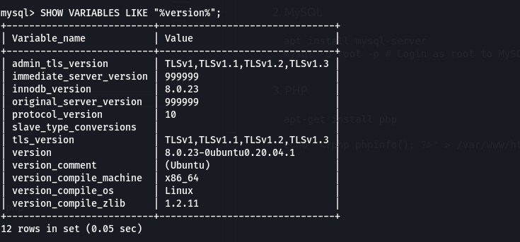
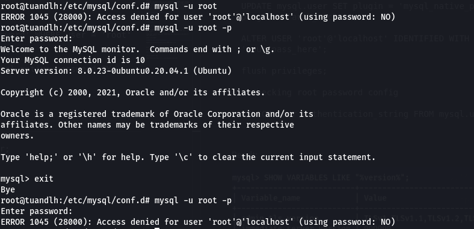
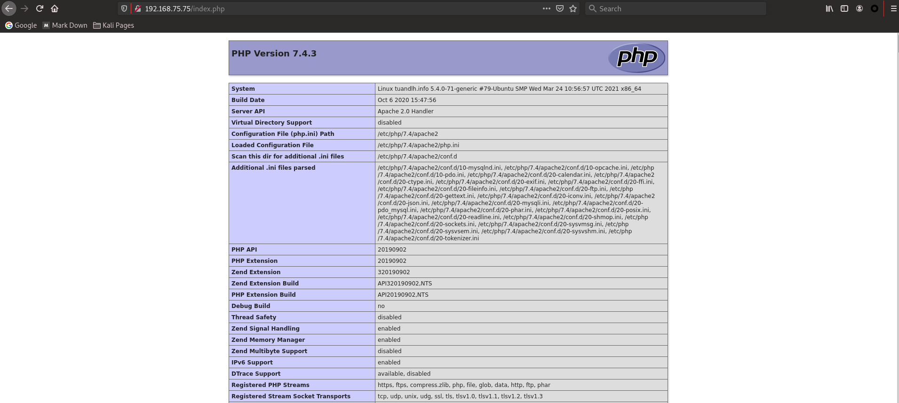
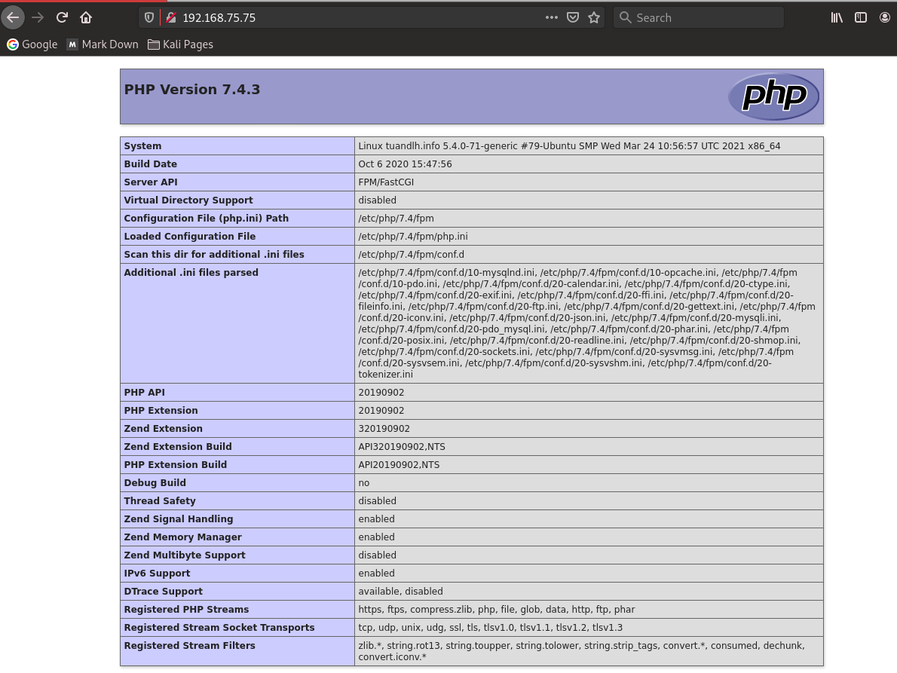
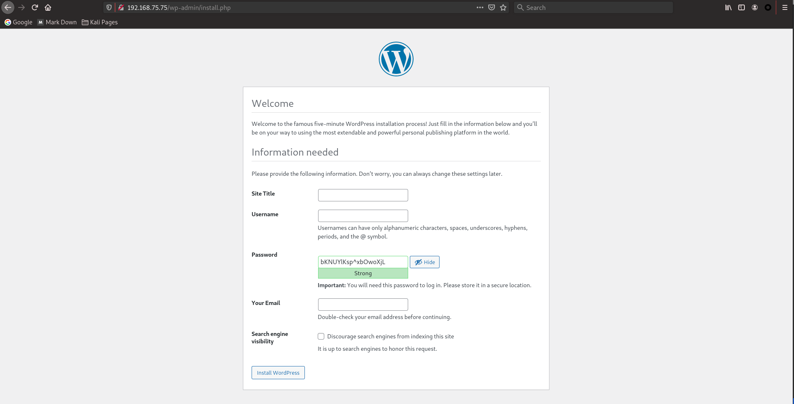
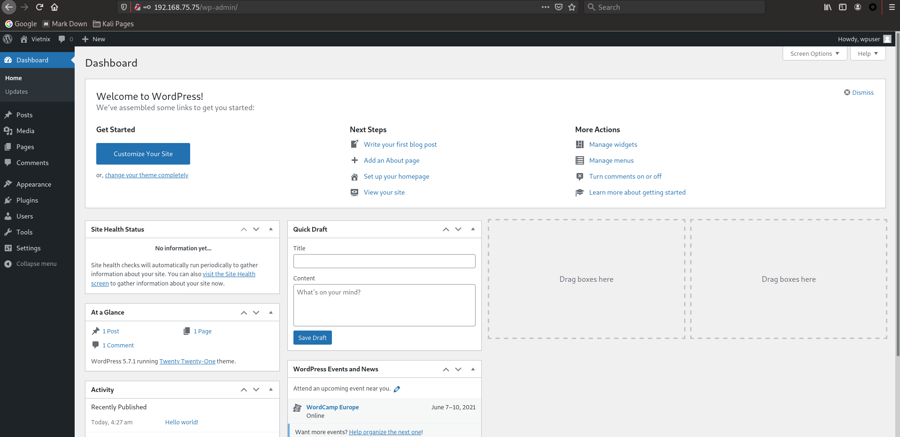
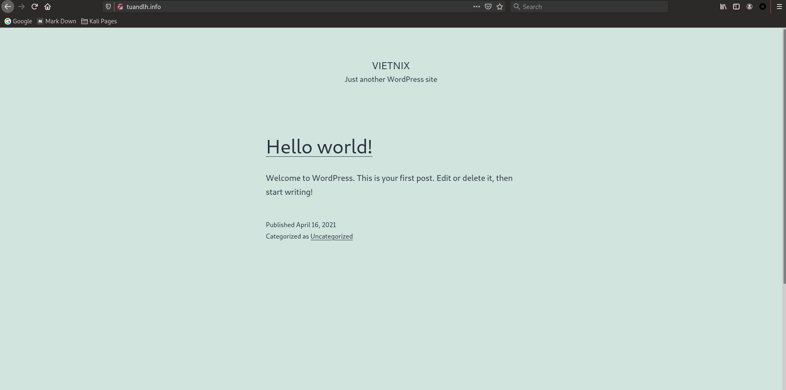

# Report_Vietnix_LinuxBasic

## BASE COMMAND:
#### `man <name_of_tool>` to see explain for tool and using Google Search to get more detail.

# *~~ MENU FOR PART 03 ~~*

1. <a href='#1'>LAMP Stack</a>
1. <a href='#2'>LEMP Stack</a>
1. <a href='#3'>Wordpress with LAMP and DNS</a>

<div id='1'></div>

# 1. LAMP Stack

### The Four Layers of a LAMP Stack

*Define:* Linux based web servers `consist of four software components`. These components, arranged in layers supporting one another, make up the software stack. Websites and Web Applications run on top of this underlying stack. The common software components that make up a traditional LAMP stack are:

* `Linux`: The operating system (OS) makes up our first layer. Linux sets the foundation for the stack model. All other layers run on top of this layer.
* `Apache`: The second layer consists of web server software, typically Apache Web Server. This layer resides on top of the Linux layer. Web servers are responsible for translating from web browsers to their correct website.
* `MySQL`: Our third layer is where databases live. MySQL stores details that can be queried by scripting to construct a website. MySQL usually sits on top of the Linux layer alongside Apache/layer 2. In high end configurations, MySQL can be off loaded to a separate host server.
* `PHP/ Perl/ Python`: Sitting on top of them all is our fourth and final layer. The scripting layer consists of PHP and/or other similar web programming languages. Websites and Web Applications run within this layer.


## DEMO `LAMP Stack` on Ubuntu Server

### 1. Apache2

```
apt-get install apache2
```

### 2. MySQL

```
apt install mysql-server
mysql -u root -p # Login as root to MySQL

# Change password root
UPDATE mysql.user SET plugin = 'mysql_native_password' WHERE user = 'root' AND plugin = 'auth_socket';

ALTER USER 'root'@'localhost' IDENTIFIED WITH mysql_native_password BY 'your_pass_here';

flush privileges;

# Checking root password config

SELECT user,authentication_string FROM mysql.user;

```

Result: 



Result after set password:



### 3. PHP

```
apt-get install php
apt install php7.4-mysql

echo "<?php phpinfo(); ?>" > /var/www/html/index.php

service apache2 restart
```

Result:



<div id='2'></div>

# 2. LEMP stack

Like LAMP stack, LEMP stack also has `PHP`, `MySQL`. It just replaces `Apache2` by `nginx`.

## Install Ngix

```
apt-get install nginx
apt-get install php7.4-fpm.sock

nano /etc/nginx/sites-available/custom_server.conf
# Edit like below

server {
        listen 80;
        root /var/www/html;
        index index.php index.html index.htm index.nginx-debian.html;
        server_name tuandlh.info;

        location / {
                try_files $uri $uri/ =404;
        }

        location ~ \.php$ {
                include snippets/fastcgi-php.conf;
                fastcgi_pass unix:/var/run/php/php7.4-fpm.sock;
        }

        location ~ /\.ht {
                deny all;
        }
}

# Link config to ../sites-enabled

sudo ln -s /etc/nginx/sites-available/custom_server.conf /etc/nginx/sites-enabled/
sudo unlink /etc/nginx/sites-enabled/default

echo "<?php phpinfo(); ?>" > /var/www/html/index.php

service nginx restart
```


Result with PHP7.4:



<div id='3'></div>

# 3. Workpress in LEMP stack with bind9 DNS

> Please review `2. LEMP stack` to install LEMP stack

## 3.1 Create new user in SQL

```
CREATE USER 'wpuser'@'localhost' IDENTIFIED BY '123456a@';
GRANT ALL PRIVILEGES ON * . * TO 'wpuser'@'localhost';
FLUSH PRIVILEGES;

# This is my trick, we can set some possible rule only need for users
# if mysql-cli is hard, we can use mySQL-admin to create user in web GUI
```

## 3.2 Create Wordpress database by wpuser above

```
mysql -u wpuser -p

CREATE DATABASE wordpressdb; 
```

## 3.3 Download and config Wordpress

```
wget https://wordpress.org/latest.zip
unzip latest.zip
cd wordpress

cp wp-config-sample.php wp-config.php
# Then edit the wp-config.php file as the username, password above
```

## 3.4 Install Wordpress

```
# Copy wordpress to /var/www/html/wordpress, then edit Root Document in NGINX

nano /etc/nginx/sites-enabled/custom_server.conf
# OR edit /etc/nginx/sites-enabled/default.conf if you didn't create custom_server.conf yet.

# using brower to connect to wordpress
http://<your ip>
```

Result: 



Result 02, config completed!



## 3.5 Install DNS

> Please review `Part 2, #3: Install DNS in Ubuntu Server with bind9`

Result:



# HAPPY ENDDING!

<a href='../README.md'>Coming back!</a>