# Report_Vietnix_LinuxBasic

## BASE COMMAND:
#### `man <name_of_tool>` to see explain for tool and using Google Search to get more detail.

# *~~ MENU FOR PART 04 ~~*

1. <a href='#1'>Nginx (Reverse Proxy) and Apache2</a>
1. <a href='#2'>Remote Access MySQL</a>
1. <a href='#3'>VSFTPD (FTP Server)</a>
1. <a href='#4'>Phpmyadmin</a>
1. <a href='#5'>Wordpress on Server</a>
1. <a href='#6'>Laravel Framework</a>

<div id='1'></div>

# 1. Nginx (Reverse Proxy) and Apache2 (Web server) in one place!

## 1.1 Install and config Nginx Reverse proxy and Apach2 

> See Part 2 #5

## Bonus Hardening Apach2

Code:

```
nano /etc/apache2/apache2.conf

# Add some line below:

ServerTokens Prod
ServerSignature Off

...

# At <Directory>, add Options '-Indexes' OR 'None'

```

Before:

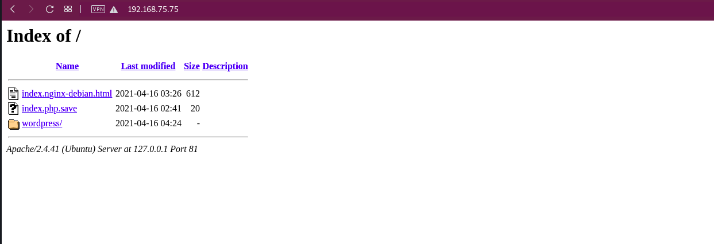

After:

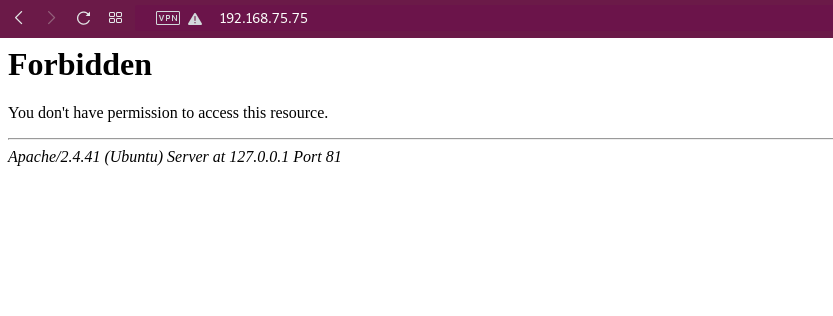


## 1.2 Config both working together!

Code:

```
nano /etc/apache2/ports.txt

# Change default port to 8080 and 444 or something else!

nano /etc/nginx/sites-available/reverse-proxy.conf

# Edit like below

Server {
        listen 80;
        server_name tuandlh.info; #change to your domain name

        location / {
                proxy_set_header X-Real-IP $remote_addr;
                proxy_set_header X-Forwarded-For $proxy_add_x_forwarded_for;
                proxy_set_header Host $http_host;
                proxy_pass http://192.168.75.75:8080;
                proxy_redirect off;
        }
}

# Link reverse-proxy.conf to /sites-enabled

# Back to Apache2 config

# NOTE: By default, Apache2 using module 'PHP7.4'. But I want it more support for NGINX, so I change 'PHP7.4' to 'FAstCGI'.

apt-get install php-fpm

# Install fastcgi

wget https://mirrors.edge.kernel.org/ubuntu/pool/multiverse/liba/libapache-mod-fastcgi/libapache2-mod-fastcgi_2.4.7~0910052141-1.2_amd64.deb
sudo dpkg -i libapache2-mod-fastcgi_2.4.7~0910052141-1.2_amd64.deb

# Enable 'actions' mode, disable mode 'php7.4'

a2enmod actions
a2dismod php7.4

# (Option) If FastCGi is not auto link to mods-enabled, linked it to!

sudo mv /etc/apache2/mods-enabled/fastcgi.conf /etc/apache2/mods-enabled/fastcgi.conf.default

nano /etc/apache2/mods-enabled/fastcgi.conf

# Edit like below

<IfModule mod_fastcgi.c>
  AddHandler fastcgi-script .fcgi
  FastCgiIpcDir /var/lib/apache2/fastcgi
  AddType application/x-httpd-fastphp .php
  Action application/x-httpd-fastphp /php-fcgi
  Alias /php-fcgi /usr/lib/cgi-bin/php-fcgi
  FastCgiExternalServer /usr/lib/cgi-bin/php-fcgi -socket /run/php/php7.4-fpm.sock -pass-header Authorization
  <Directory /usr/lib/cgi-bin>
    Require all granted
  </Directory>
</IfModule>

# Restart both engines

```

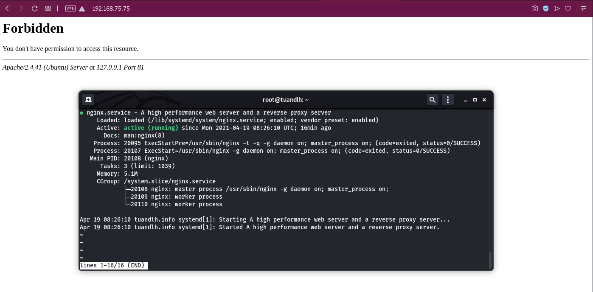

<div id='2'></div>

# 2. Remote Access MySQL

Code:

```
nano /etc/mysql/mysql.conf.d/mysqld.cnf

# Comment on the 'bind-address = 127.0.0.1' line

# In some old version we also comment 'skip-networking'

# Log in to the database server.
# Connect to the MySQL database as the root user.
# Enter the following command:

mysql> CREATE USER 'root'@'%' IDENTIFIED BY 'PASSWORD';
mysql> GRANT ALL PRIVILEGES ON *.* TO 'root'@'%' WITH GRANT OPTION;

# We can replace '%' by specific IP we want to remote from, '*.*' can be replace with <database name>.<table name>. #

# BINGO, TEST result by:

mysql> -u root -h <Server SQL IP> -p

```

Result: 

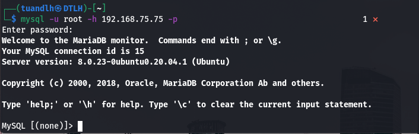

<div id='3'></div>

# 3. VSFTPD (FTP Server)

Using `apt-get install vsftpd` to install FTP Server

```
systemctl enable vsftpd # Start with system

systemctl start vsftpd # Start now

cp /etc/vsftpd.conf /etc/vsftpd.conf.backup # Create backup
nano /etc/vsftpd.conf

# Edit some lines in 'vsftpd.conf' like:

listen=YES
listen_ipv6=NO
anonymous_enable=NO
write_enable=YES
pasv_enable=YES         # This is for case I'm not using SSL.
pasv_max_port=10001
pasv_min_port=10000

ssl_enable=YES # This is option if you want to using SSL for your VSFTPD Server

# Note: In client side, after login, you need to enter passive mode by command 'passive' if you do not use SSL to tranfer!

```

Result:

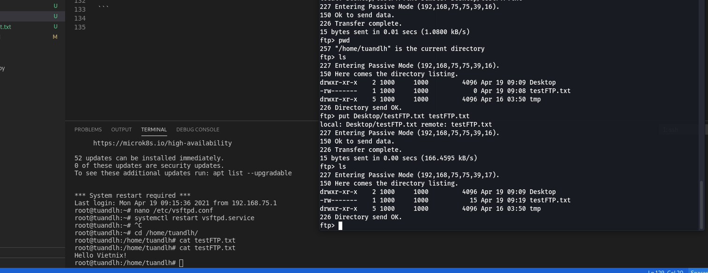

<div id='4'></div>

# 4. Phpmyadmin

Code:
```
apt-get install phpmyadmin

# Following step by step in GUIDE config

nano /etc/phpmyadmin/config-db.php

# Check Username and password for dababase!

# Using web brower to login: http://<Your IP>/phpmyadmin

# User name:  phpmyadmin
# Password:   <#You created before>

```

Result:

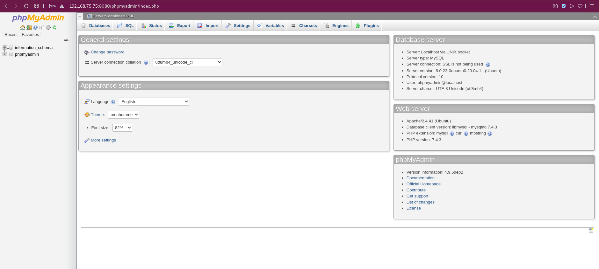

<div id='5'></div>

# 5. Wordpress on Server

> See Part 3 #3

In this step, I recreated a new database and edit 'wp-config.php'.

Result 01:

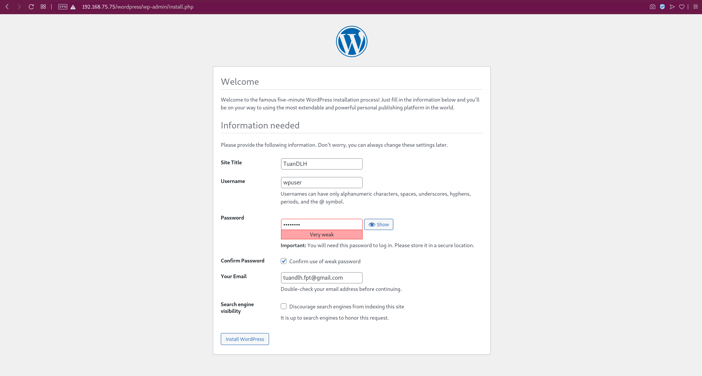

Result 02:

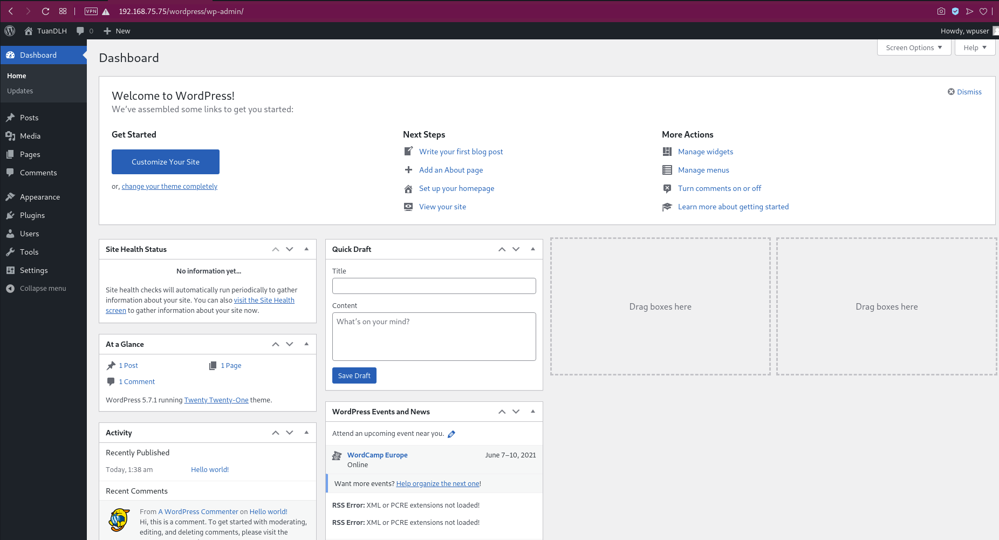

<div id='6'></div>

# 6. Laravel Framework

- Config DATABASE:

```
# Config database:
mysql -root -p

CREATE USER 'larauser'@'localhost' IDENTIFIED BY '123456a@';
GRANT ALL PRIVILEGES ON * . * TO 'larauser'@'localhost';
FLUSH PRIVILEGES;

# Re Login MySQL using 'larauser'

CREATE DATABASE laraveldb;
FLUSH PRIVILEGES;
```

- Install Composer

```
cd /home/tuandlh/tmp
curl -sS https://getcomposer.org/installer -o composer-setup.php

# (Option) Verified Installer File
HASH="$(wget -q -O - https://composer.github.io/installer.sig)"
php -r "if (hash_file('SHA384', 'composer-setup.php') === '$HASH') { echo 'Installer verified'; } else { echo 'Installer corrupt'; unlink('composer-setup.php'); } echo PHP_EOL;"

# Install Composer
php composer-setup.php --install-dir=/usr/local/bin --filename=composer

```

Result: 

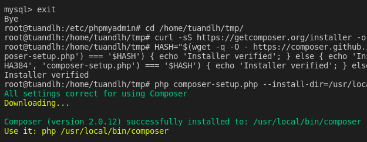

- Install Laravel

```
useradd -m /home/larauser larauser
passwd larauser   # Create user for install Laravel, causion with ROOT!
adduser larauser sudo

cd /var/www/html
sudo composer create-project --prefer-dist laravel/laravel demolara

chown -R larauser:larauser demolara # Change owner to 'larauser'

cd demolara
php artisan serve --host=192.168.75.75 --port=8000

# NOTE: if command above stopped, you cannot using Laravel! Following config will solved it!
```

Result 01:

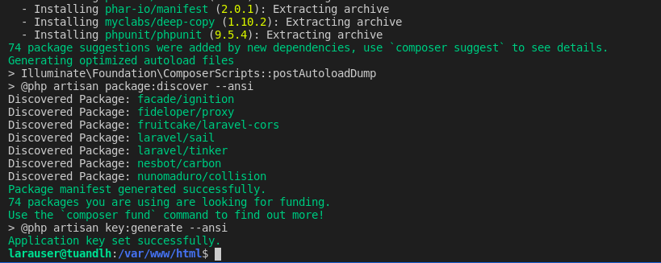

Result 02:

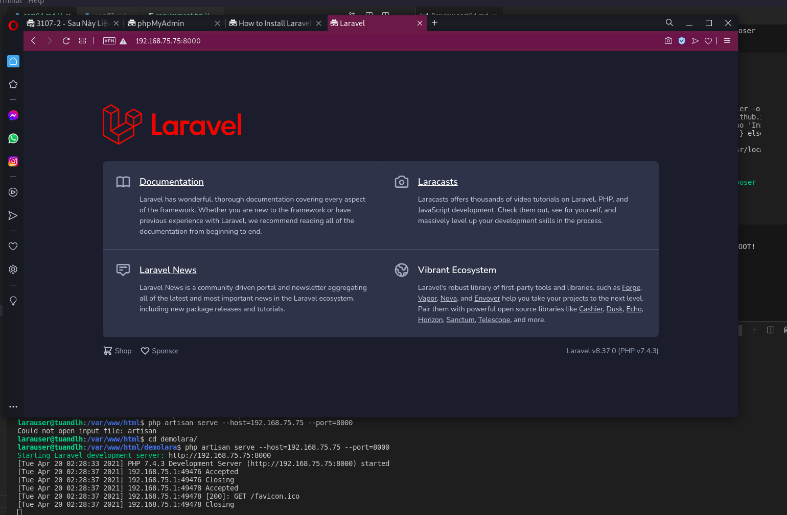

- Config Laravel

```
nano /var/www/html/demolara/.env

# Edit database like below:

DB_CONNECTION=mysql
DB_HOST=127.0.0.1
DB_PORT=3306
DB_DATABASE=laraveldb
DB_USERNAME=larauser
DB_PASSWORD=123456a@

chown -R www-data:www-data /var/www/html/demolara/
chmod -R 775 /var/www/html/demolara/

# Create new config for laravel
nano /etc/apache2/sites-available/laravel.conf

# Edit like below:

<VirtualHost *:8080>

        ServerAdmin webmaster@example.com
        DocumentRoot /var/www/html/demolara/public
        ServerName www.tuandlh.info
        <Directory />
                Options FollowSymLinks
                AllowOverride None
        </Directory>
        <Directory /var/www/html/demolara>
                AllowOverride All
        </Directory>

        ErrorLog ${APACHE_LOG_DIR}/error.log
        CustomLog ${APACHE_LOG_DIR}/access.log combined

</VirtualHost>

# link 'laravel.conf' from sites-available/ to sites-enabled/

# Restart Apache2

```

Now Laravel is running in default port! ADD DNS IF YOU WANT!

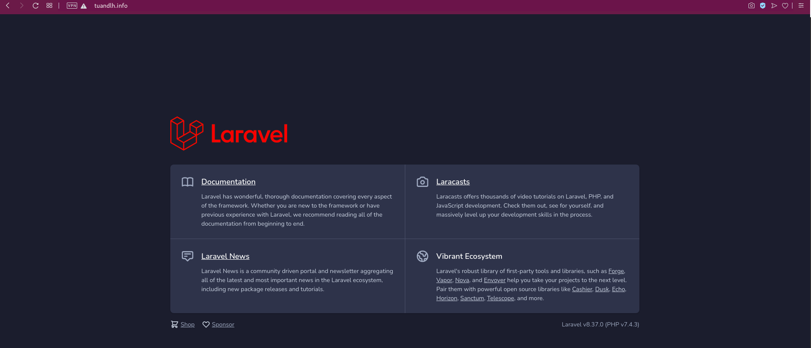

# HAPPY ENDDING!

<a href='../README.md'>Coming back!</a>


