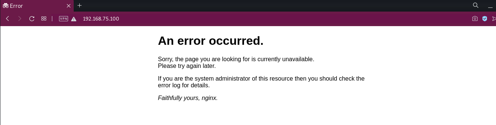
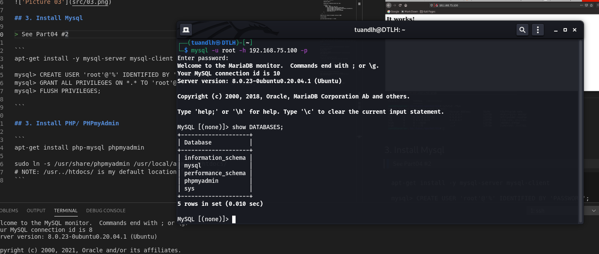
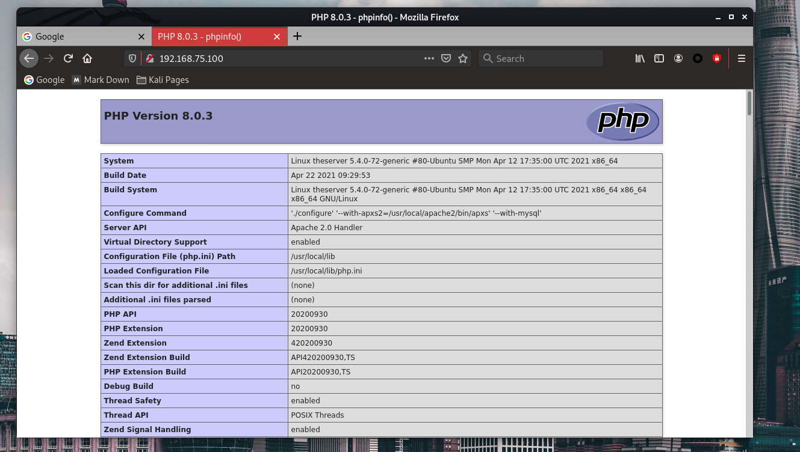
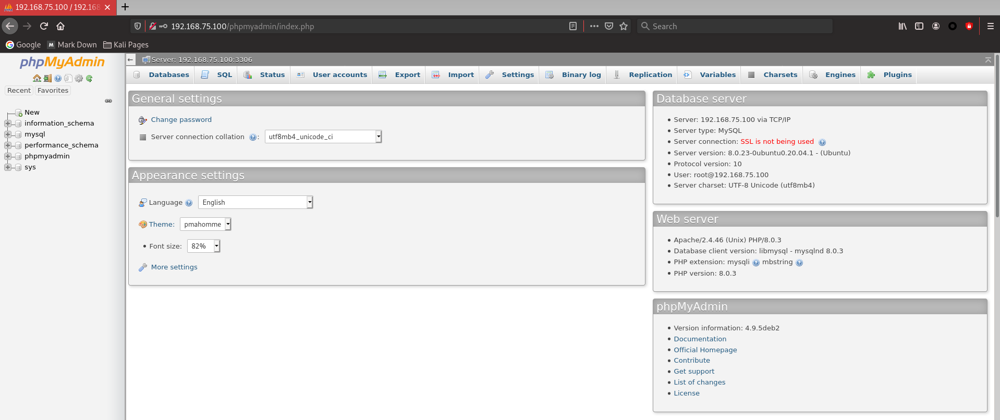
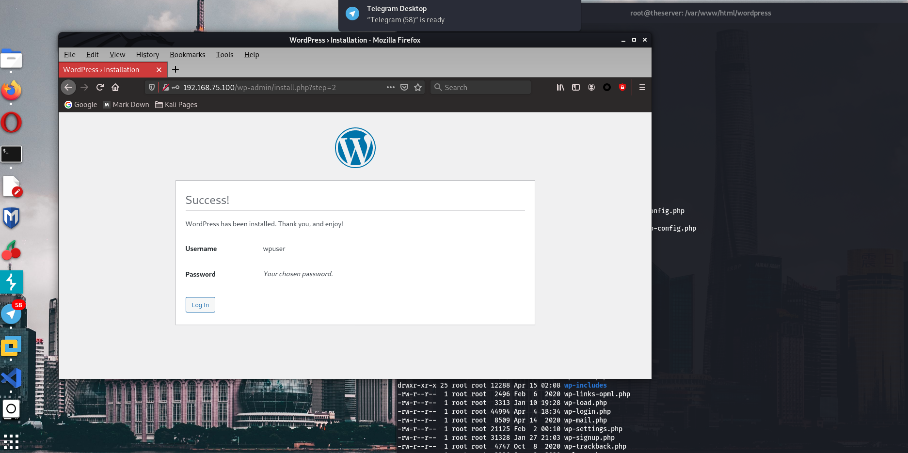
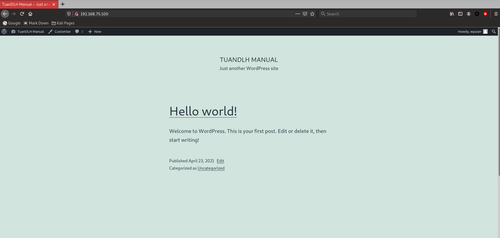
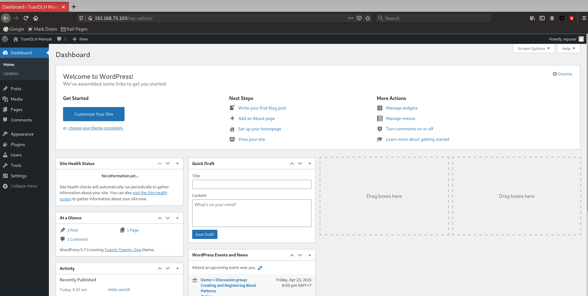
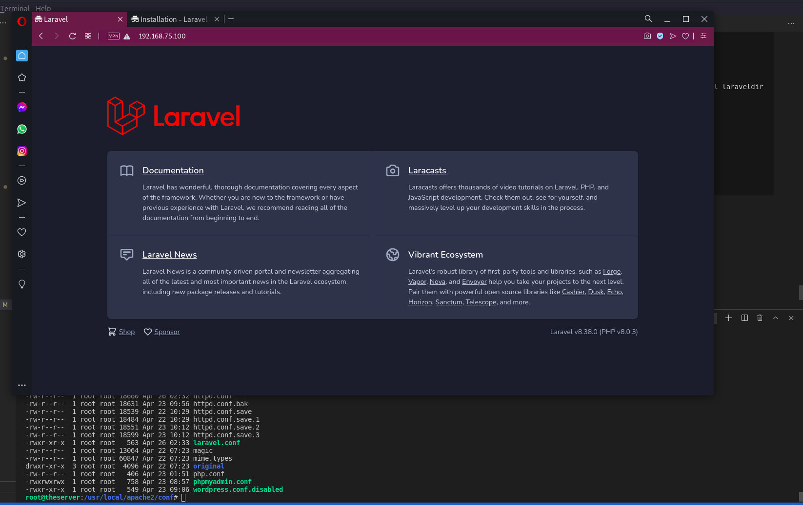

# Report_Vietnix_LinuxBasic

# *~~ MENU FOR PART 06 ~~*

1. <a href='#1'>Manual NGINX</a>
1. <a href='#2'>Manual Compile Apache2</a>
1. <a href='#3'>Install Mysql</a>
1. <a href='#4'>Install PHP/ PHPmyAdmin</a>
1. <a href='#5'>VSFTPD</a>
1. <a href='#6'>Install Wordpress on LAMP Model</a>
1. <a href='#7'>Install Laravel on LAMP Model</a>

<div id='1'></div>

# 1. Manual NGINX

## 1.1 NGINX dependencies 


```
apt-get install -y gcc g++ libssl-dev make

wget https://ftp.pcre.org/pub/pcre/pcre-8.44.tar.gz
tar -zxf pcre-8.44.tar.gz
cd pcre-8.44
./configure --disable-dependency-tracking
make
sudo make install

wget http://zlib.net/zlib-1.2.11.tar.gz
tar -zxf zlib-1.2.11.tar.gz
cd zlib-1.2.11
./configure
make
sudo make install

# Allow port and start Nginx
sudo ufw allow 80
sudo /usr/local/nginx/sbin/nginx

```

## 1.2 Download and compile Nginx as Reverse Proxy

```
mkdir tmp && cd tmp
wget https://nginx.org/download/nginx-1.18.0.tar.gz

tar -zxf nginx-1.18.0.tar.gz

cd nginx-1.18.0/

./configure \
--with-http_ssl_module \
--with-stream \
--without-http_empty_gif_module \
--with-pcre=../pcre-8.44 \
--with-zlib=../zlib-1.2.11 \

make && make install

```


```
nano /usr/local/nginx/conf/nginx.conf

# Edit some lines as below:

http {
    include       mime.types;
    default_type  application/octet-stream;
    sendfile        on;
    keepalive_timeout  65;

    server {
        listen       80;
        server_name  localhost;

        #charset koi8-r;

        #access_log  logs/host.access.log  main;

        location / {
            #root   html;
            #index  index.html index.htm;
                proxy_set_header X-Real-IP $remote_addr;
                proxy_set_header X-Forwarded-For $proxy_add_x_forwarded_for;
                proxy_set_header Host $http_host;
                proxy_pass http://192.168.75.100:8080;
                proxy_redirect off;
        }
        ...
    }

# Next we will config for Apache2 running at 8080!

# Reload NGINX

/usr/local/nginx/sbin/nginx -s reload
```



<div id='2'></div>

# 2. Manual Compile Apache2

## 2.1 Apache2 Dependancies

```
# Need APR, APR-Util, PCRE, GCC

apt-get install libexpat-dev

wget https://downloads.apache.org/apr/apr-1.6.5.tar.gz 
tar xvzf apr-1.6.5.tar.gz
cd apr-1.6.5.tar.gz/

make && make install

# APR Utils:
wget https://downloads.apache.org/apr/apr-util-1.6.1.tar.gz 

# Install like above, only have the command below DIFFERENT!
./configure --with-apr=/usr/local/apr/bin

# Install APR-ICONV (like above): https://downloads.apache.org/apr/apr-iconv-1.2.2.tar.gz  
```

## 2.2 Apache2 install

```
wget https://mirror.downloadvn.com/apache//httpd/httpd-2.4.46.tar.gz

gzip -d httpd-2.4.46.tar.gz
tar vxf httpd-2.4.46.tar
cd httpd-2.4.46/

# sudo mkdir /etc/apache2
sudo ./configure --with-apr=/usr/local/apr/bin #--prefix=/etc/apache2
make && make install

# Change Config:

nano /usr/local/apache2/conf/httpd.conf

# Change port to 8080 (for NGINX Reverse Proxy), set 'ServerName'.

# Start Apache2

sudo /usr/local/apache2/bin/httpd

```


<div id='3'></div>

# 3. Install Mysql

> See Part04 #2

```
apt-get install -y mysql-server mysql-client

mysql> CREATE USER 'root'@'%' IDENTIFIED BY 'PASSWORD';
mysql> GRANT ALL PRIVILEGES ON *.* TO 'root'@'%' WITH GRANT OPTION;
mysql> FLUSH PRIVILEGES;

```

RESULT:



<div id='4'></div>

# 4. Install PHP/ PHPmyAdmin

```
apt-get install pkg-config libxml2-dev libsqlite3-dev libonig-dev
wget https://www.php.net/distributions/php-8.0.3.tar.gz

tar xzvf php-8.0.3.tar.gz
cd php-8.0.3/

./configure --with-apxs2=/usr/local/apache2/bin/apxs --with-mysql=/usr/local/mysql --with-mysqli --with-openssl=/usr/bin/openssl --enable-mbstring --with-gettext --with-zlib 

make && make install

cp php.ini-development /usr/local/lib/php.ini

nano /usr/local/apache2/conf/php.conf

# Create php config as below:

<Files *.php>
SetOutputFilter PHP
SetInputFilter PHP
LimitRequestBody 9524288
</Files>
AddType application/x-httpd-php .php
AddType application/x-httpd-php-source .phps
#
# Add index.php to the list of files that will be served as directory
# indexes.
#
DirectoryIndex index.php

###############################

nano /usr/local/apache2/conf/httpd.conf

# Add module and IMPORT php.conf

LoadModule php_module modules/libphp.so
Include "conf/php.conf"

###############################
# INSTALL PHPMYSQL

apt-get install phpmyadmin
cp -r /usr/share/php/* /usr/share/phpmyadmin/

nano /usr/local/apache2/conf/phpmyadmin.conf

# Edit like below:

# phpMyAdmin default Apache configuration

Alias /phpmyadmin /usr/share/phpmyadmin

<Directory /usr/share/phpmyadmin>
    Options SymLinksIfOwnerMatch
    DirectoryIndex index.php
    
    Require all granted    

    # limit libapache2-mod-php to files and directories necessary by pma
    <IfModule mod_php7.c>
        php_admin_value upload_tmp_dir /var/lib/phpmyadmin/tmp
        php_admin_value open_basedir /usr/share/phpmyadmin/:/etc/phpmyadmin/:/var/lib/phpmyadmin/:/usr/share/php/php-gettext/:/usr/s>
    </IfModule>

</Directory>

# Disallow web access to directories that don't need it
<Directory /usr/share/phpmyadmin/templates>
    Require all denied
</Directory>
<Directory /usr/share/phpmyadmin/libraries>
    Require all denied
</Directory>

##########################################

nano /usr/local/apache2/conf/httpd.conf

# Add line below:

Include 'conf/phpmyadmin.conf'

##################3

chown -R www-data:www-data /var/lib/phpmyadmin

nano /etc/phpmyadmin/config-db.php

# Change username, password and database name for phpmyadmin

# Restart Apache2

```

Result 01, PHP:



Result 02, PhpMyAdmin



<div id='5'></div>

# 5. VSFTPD

> See part 04 #3

<div id='6'></div>

# 6. Install Wordpress on LAMP Model

> See Part 03 #3 for more details!

```
# This part, I copy Wordpress folder to /var/www/html/wordpress and create config at Apache2

cp wp-config-sample.php wp-config.php

nano wp-config.php

# Edit database name, username, password you want to using for Wordpress

cd /usr/local/apache2/conf
nano wordpress.conf

# Edit like below:

                                     
<VirtualHost *:8080>

        ServerAdmin webmaster@example.com
        DocumentRoot /var/www/html/wordpress
        ServerName wordpress.tuandlh.info

        <Directory />
#               Require all granted
                Options Indexes FollowSymLinks
                AllowOverride None
                DirectoryIndex index.php
                Require all granted
        </Directory>

        <Directory /var/www/html/wordpress>
                Options Indexes FollowSymLinks
                AllowOverride None
                DirectoryIndex index.php
                Require all granted
        </Directory>

</VirtualHost>

# Restart Apache2

```

Result: 



Result 02:



Result 03:



<div id='7'></div>

# 7. Install Laravel on LAMP Model

> See part 04 #6 to more detail!

```
# Disable wordpress.conf

cd /usr/local/apache2/conf

mv wordpress.conf wordpress.conf.disabled

nano /usr/local/apache2/conf/httpd.conf

# Edit httpd.conf, disable 'Include "conf/wordpress.conf"', Add new line 'Include "conf/laravel.conf"'

# Create Laravel Config for Apache2

nano laravel.conf

# Edit Like below

VirtualHost *:8080>

        ServerAdmin webmaster@example.com
        DocumentRoot /var/www/html/laraveldir/public
        ServerName laravel.tuandlh.info

        <Directory />
#               Require all granted
                Options Indexes FollowSymLinks
                AllowOverride None
                DirectoryIndex index.php
                Require all granted
        </Directory>

        <Directory /var/www/html/laraveldir>
                AllowOverride All
        </Directory>

</VirtualHost>


############################################

# Config Database!

mysql -uroot -p

CREATE USER 'larauser'@'%' IDENTIFIED BY '123456a@';
GRANT ALL PRIVILEGES ON * . * TO 'larauser'@'%';
FLUSH PRIVILEGES;

# Relogin with larauser in MySQL

CREATE DATABASE laraveldb;
FLUSH PRIVILEGES;

####

# Install composer

curl -sS https://getcomposer.org/installer -o composer-setup.php

php composer-setup.php --install-dir=/usr/local/bin --filename=composer

# Install Laravel

cd /var/www/html
sudo composer create-project --prefer-dist laravel/laravel laraveldir

cd laraveldir/
nano .env

# Then edit database config like above

chown -R www-data:www-data /var/www/html/laraveldir/
chmod -R 775 /var/www/html/laraveldir/

# Restart Apache2

```

Result: 



# HAPPY ENDDING!

<a href='../README.md'>Coming back!</a>