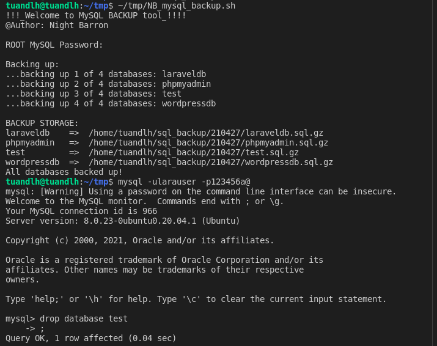
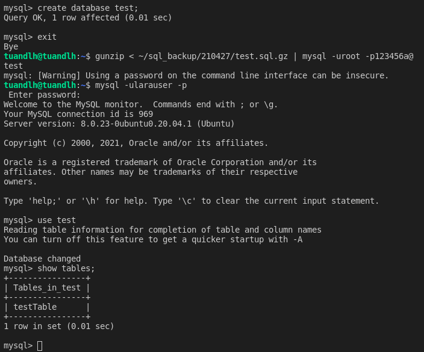
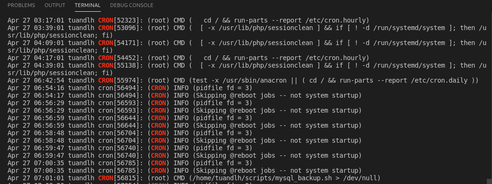

# Report_Vietnix_LinuxBasic

# *~~ MENU FOR PART 07 BASH SHELL BACKUP MySQL ~~*

# 1. Create tool for Backup (BashShell and Python)

> Source code in: https://github.com/nightbarron/MySQL_Backup_Tool

With `/bin/bash` shell, I recommend to run locally, and if you want to backup remote MySQL Server to your local, I refer `python` one!!!

## Result 01: Create database and table for testing tool!


## Result 02: Running tool and drop database;



## Result 03: Restore and show table in database to check;



# 2. Using Cron for Daily backup

```
# Edit mysql_backup.sh file to HARD PASSWORD!!!

mkdir /root/scripts
cp /path_to_file/mysql_backup.sh ~/script/

nano /etc/crontab
ls -la
# Add one line as below: 
15 9    * * *   root    /root/scripts/mysql_backup.sh > /dev/null

# or this for python:
15 9    * * *   root    python /root/scripts/mysql_backup.py > /dev/null

# Restart crontab

systemctl restart crond.service

# Checking if CRONTAB working or not (change CRON cycle to 1 minute and check)

grep CRON /var/log/syslog

```

Config: 


Crontest: 



# HAPPY ENDDING!

<a href='../README.md'>Coming back!</a>
