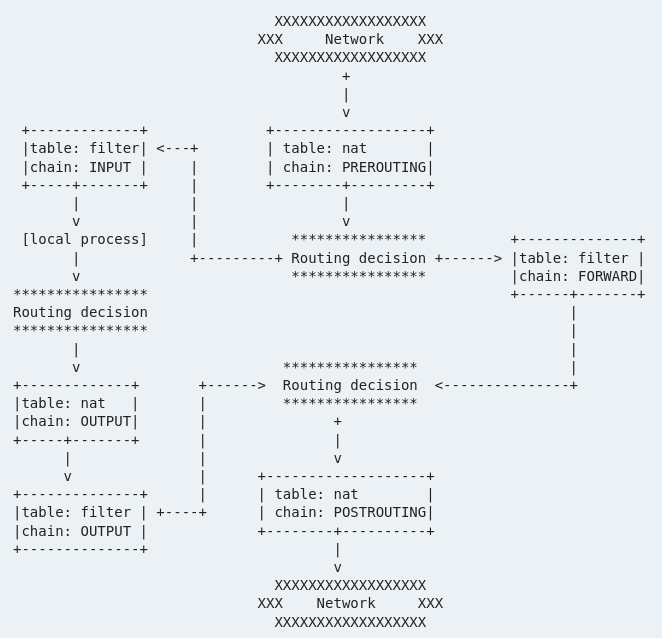
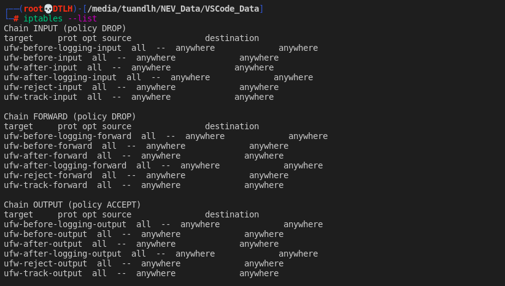
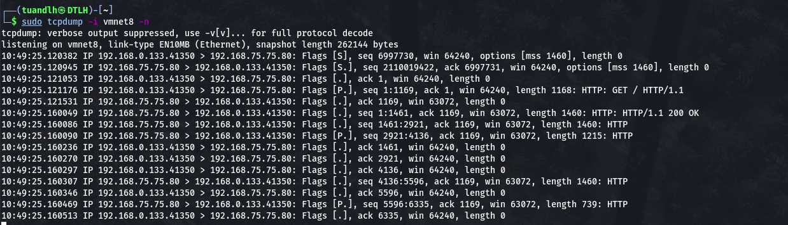
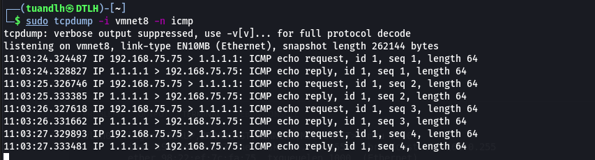
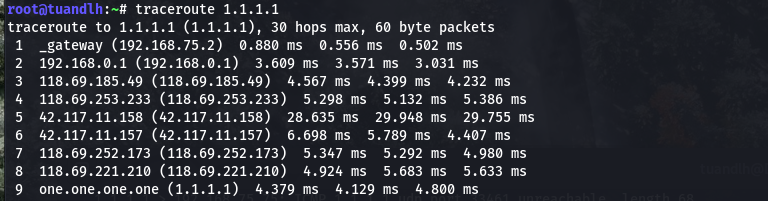

# Report_Vietnix_LinuxBasic

# *~~ MENU FOR PART 08 IPTABLES && NETWORK FLOW ~~*

# 1. Iptables packet flow diagram

### What is iptables?

Iptables is used to inspect, modify, forward, redirect, and/or drop IP packets. The code for filtering IP packets is already built into the kernel and is organized into a collection of tables, each with a specific purpose. The tables are made up of a set of predefined chains, and the chains contain rules which are traversed in order.

The structure is: `iptables` -> `Tables` -> `Chains` -> `Rules`. 

### Flow Diagram: Simpilied packets in iptables (NOT include `raw`, `mangle` and `security` tables)



> Explain:

* Tables: iptables has five tables
    * `raw` is used only for configuring packets so that they are exempt from connection tracking.
    * `filter` is the default table, and is where all the actions typically associated with a firewall take place.
    * `nat` is used for network address translation (e.g. port forwarding).
    * `mangle` is used for specialized packet alterations.
    * `security` is used for Mandatory Access Control networking rules (In new versions)

* `Tables` consist of `chains`, which are lists of `rules` which are followed in order. The default table, `filter`, contains three built-in chains: `INPUT`, `OUTPUT` and `FORWARD` which are activated at different points of the packet filtering process, as illustrated in the flow chart. The `nat` table includes `PREROUTING`, `POSTROUTING`, and `OUTPUT` chains. 

If you want to list all `chains` in `table`:

```
iptables -L -t <table_name>
```

Following are the `key points` to remember for the `iptables rules`.

* Rules contain a criteria and a target.
* If the criteria is matched, it goes to the rules specified in the target (or) executes the special values mentioned in the target.
* If the criteria is not matached, it moves on to the next rule.

The code `iptables --list` will show all chain in `filter` default table!!!



The rules in the `iptables --list` command output contains the following fields:

* `num` – Rule number within the particular chain
* `target` – Special target variable that we discussed above
* `prot` – Protocols. tcp, udp, icmp, etc.,
* `opt` – Special options for that specific rule.
* `source` – Source ip-address of the packet
* `destination` – Destination ip-address for the packet


Target Values: Following are the `possible special values` that you can specify in the `target`.

* `ACCEPT` – Firewall will accept the packet.
* `DROP` – Firewall will drop the packet.
* `QUEUE` – Firewall will pass the packet to the userspace.
* `RETURN` – Firewall will stop executing the next set of rules in the current chain for this packet. The control will be returned to the calling chain.

### Simulation

1. Destination is IP of Server:

```
Packets/Network >  PREROUTING/nat > Routing decision > INPUT/filter > Local process
```

> Explain: `packets` for network, when be sent to server. The first chain is `PREROUTING` of `nat` will catch it. This helps to translate the `destination ip address` of the packets to something that matches the routing on the `local server`. Then `routing decision` will decide if the packets belong to server or not! If so, The packet will be filter by `INPUT/filter` chain/table.

1. SourceIP is Server:

```
Local process > Routing decision > OUTPUT/nat > OUTPUT/filter > Routing decision > POSROUTING/nat > Packets/Network
```

> Explain: Data from `Local process` will be decided by `routing decision` whether they were send to `network` or `other local process`. If `network` it will come to `OUTPUT/nat` for locally generated packets on the firewall. The packets then will be send to `OUTPUT/filter` to make sure if the packet is allowed to sent out. `Routing decision` again decided if the packet is `localhost` or `other IPs`, then if it's other IP, `Server` will sent it to `POSROUTING/nat`. This helps to translate the `source ip address` of the packets to something that might match the `routing` on the destination server.

1. Packet come to Server, but that is not for Server!!!

```
Packets/Network > PREROUTING/nat > Routing decision > FORWARD/filter > Routing decision > POSTROUTING/nat > Network
```

> Explain: Just as the `#1 Destination is IP of Server` except at this part, `Routing decision` recognizes that packets not belong to Server, so it will be send to `FORWARD/filter`. If the `FORWARD chain` know where is the packets's destination, it will send to `other Routing decision`, else `FORWARD/filter` will DROP it. 

# 2. TRACKING some packets!!! (using TCPDUMP)


### 2.1 Tracking SYN from Vietnix's IP to Lab Server

```
tcpdump -i vmnet8 -n
```



> Explain: When Client request to webserver at `192.168.75.75.80`. The flag is `[S]` mean SYN flag. Then the server respones with `[S.]` (SYN-ACK) packet. Final a packet with flag `[.]` (ACK) will be send from client `(Three-way handshake)`. The next packet is marked `[P]` mean the connection is ready for `PUSH DATA`.

### 2.2 Tracking ICMP from Lab Server to 1.1.1.1

```
tcpdump -i vmnet8 -n icmp
```



> Explain: It simply sents a request `ICMP` to 1.1.1.1 and waiting for 1.1.1.1 reply!!!



> Explain: This is full `tracepath` of the connection!

# 3. IPTABLES Rules

```
# BLOCK PORT
iptables -A INPUT -p tcp --destination-port <port number> -j DROP

# BLOCK IP:PORT
iptables -A INPUT -p tcp -s <src IP> --destination-port <port number> -j DROP

# ACCEPT PORT (Just change target value)
iptables -A INPUT -p tcp --destination-port <port number> -j ACCEPT

# BLOCK NEW CONNECTION (--syn)
iptables -A INPUT -p tcp --syn --destination-port <port number> -j DROP # Actually, it DROP syn packet

# OR (drop all connection with marked NEW)
iptables -I INPUT 1 -m state --state NEW --destination-port <port number> -j DROP

# BLOCK CONNECTION WITH TTL AND LENGTH
iptables -A OUTPUT -m ttl --ttl-gt 64,128 -m length --length 1000 -s <block ip> --dport <port number> -j DROP

# ADD COMMENT (-m comment --comment "<Comment content>")
iptables -A INPUT --dport 22 -j ACCEPT -m comment --comment "allow ssh"
 
```

# 4. TCPDUMP details