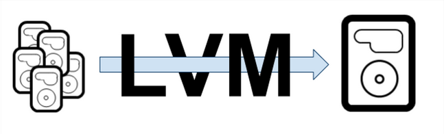
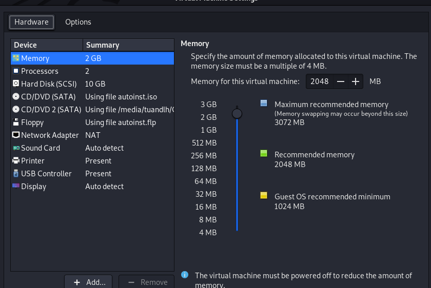
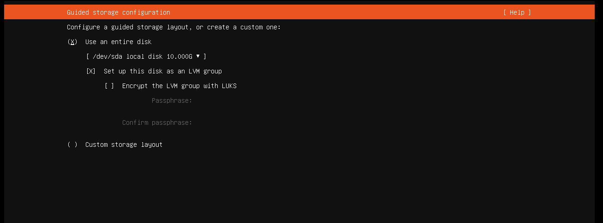
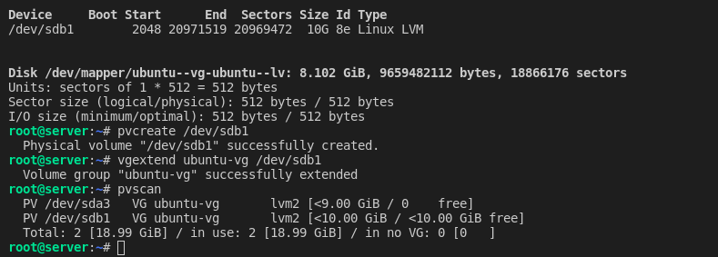
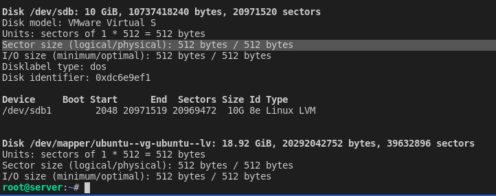
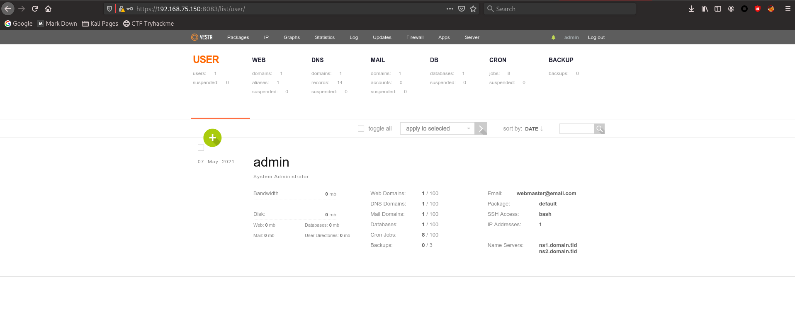
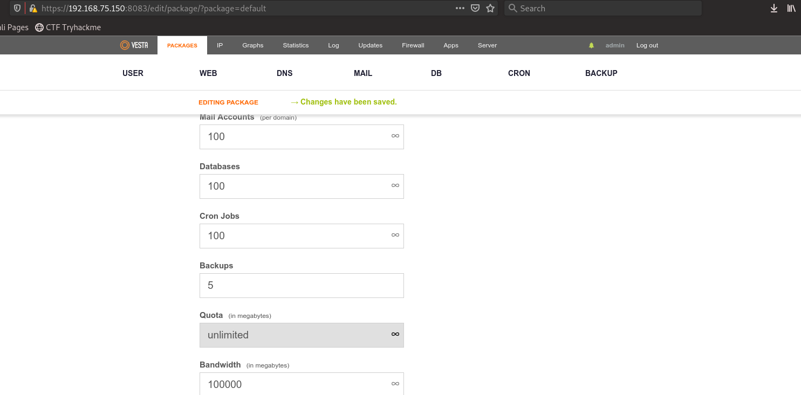
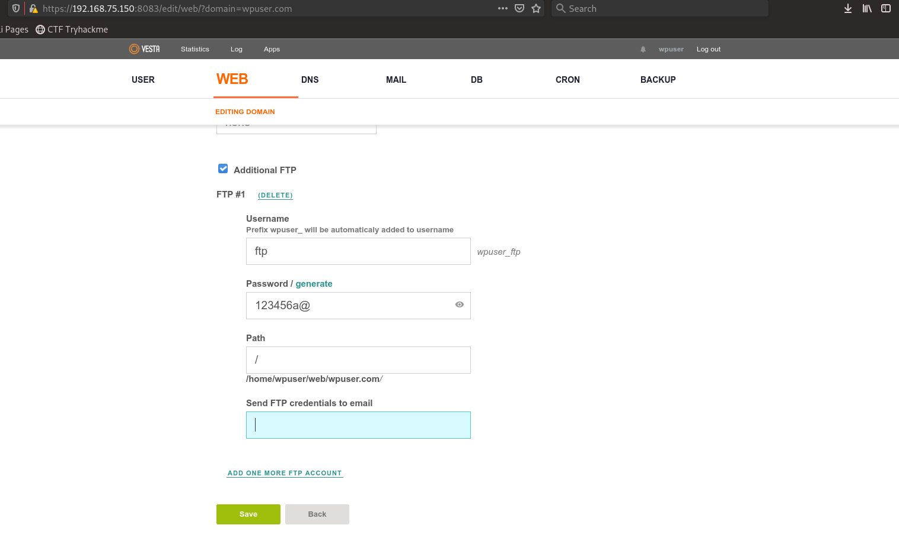
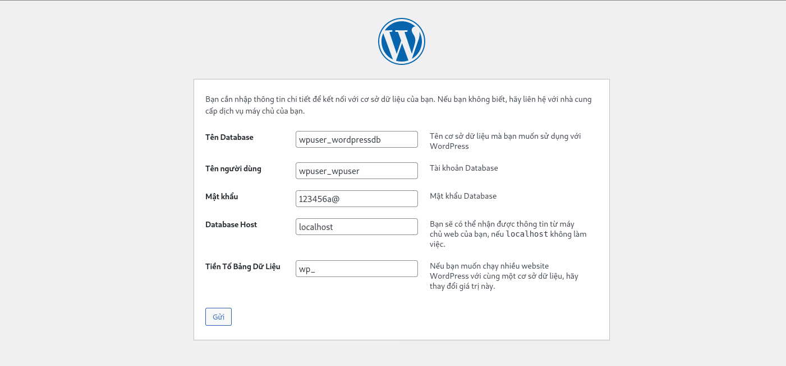
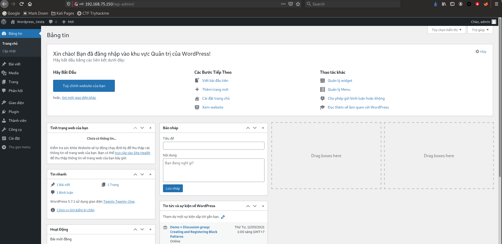

# Report_Vietnix_LinuxBasic

# *~~ MENU FOR PART 09 LVM & VestaCP ~~*

1. <a href='#1'>LVM</a>
1. <a href='#2'>VestaCP</a>
1. <a href='#3'>Test with Wordpress</a>

<div id='1'></div>

# 1. LVM (Logical Volume Manager)

> Define: `Logical Volume Manager` allows for a layer of abstraction between your operating system and the disks/partitions it uses.



## 1.1 Config LVM in setup with ONE 10G!!!

### - Prepare: One 10G disk!!!



### - Start VMware and install Ubuntu Server

### - Using entire and Tick at SET UP as LVM in this part!!!



### => Install and FINISH!!!

## 1.2 Config LVM in Running OS

> We add ONE MORE 10G disk to OS above and RESTART!!!

Command:

```
# List all volume and disk
fdisk -l        # We must find where is the name of new physical disk

# See LVM Group name (Mine is ubuntu-vg)
pvscan

# Config new disk (/dev/sdb is mine)
fdisk /dev/sdb

# Create new partition as Linux LVM
n
p
/Enter
/Enter
t
8e
w

# Create new physical LVM
pvcreate /dev/sdb1

# ADD new physical to LVM Group
vgextend ubuntu-vg /dev/sdb1

# Increase size of logical volume (/ partition)
lvm
lvextend -L+9.9G /dev/ubuntu-vg/ubuntu-lv # I don't know but it missing 1 byte :((

# Resize of file
 resize2fs /dev/ubuntu-vg/ubuntu-lv

 # OR
df -Th /        # Check Format storage type, if xfs, then:
xfs_growfs /dev/centos/root


 # Check /dev/mapper/ubuntu--vg-ubuntu--lv
 df

```


> Explain: We can see result above have two physical as in one LVM Group



> Check /dev/mapper/ubuntu--vg-ubuntu--lv

<div id='2'></div>

# 2. VestaCP (Support Ubuntu Server 18.04 or older)

> about demo Cpanel, please see part 2/#4 - 4.4

```
curl -O http://vestacp.com/pub/vst-install.sh

bash vst-install.sh --nginx yes --apache yes --phpfpm no --named yes --remi yes --vsftpd yes --proftpd no --iptables yes --fail2ban yes --quota no --exim yes --dovecot yes --spamassassin yes --clamav yes --softaculous yes --mysql yes --postgresql no --hostname tuandlh.info --email webmaster@email.com --password 123456a@

```



> Edit backup time: Cron -> "sudo /usr/local/vesta/bin/v-backup-users". Then edit backup every 5 minutes!!!

> Then click Packages -> Default -> Change Backups from 3 to 5



<div id='3'></div>

# 3. Test with Wordpress

\- Create user wpuser in VestaCP \
\- Relogin with `wpuser` \
\- Create Database for Wordpress as below \
\- Using new `wpuser_wpuser` - `123456a@` to connect to phpmyadmin 


\- Using tab `web` to create new web - addition FTP \
\- Using FTP with `wpuser_ftp` - `123456a@` account to connect to server and up wordpress at `/public_html` \
\- OR SSH to server at `/home/<user_name>/web/<domain_name>/public_html`, then download wordpress



\- Connect to Web server Port 80, edit value as possible



\- Install and DONE!!!



# HAPPY ENDDING!

<a href='../README.md'>Coming back!</a>
